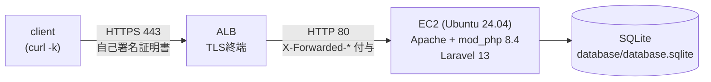

# アーキテクチャ

## 構成図

- クライアントは自己署名証明書のALBに対して `curl -k` でHTTPSアクセスする。
- ALBはTLSを終端し、EC2へは平文HTTP:80で転送する。このときALBが `X-Forwarded-Proto: https` などのヘッダを付与する。
- EC2上のApache + mod_phpがLaravelを実行し、SQLite（ローカルファイル）に読み書きする。

## なぜ自己署名HTTPSなのか

このリポジトリの目的は TrustProxies / TrustHosts の挙動差分を **scheme（http/https）の反転として観測できること** にある。ALBでHTTPS終端しEC2へHTTP転送する構成では、Laravel側が `X-Forwarded-Proto` を信頼するかどうかで `isSecure()` / `getScheme()` の結果が変わる。これを再現するには実際にALBをHTTPSで受ける必要があるが、独自ドメイン・公開証明書は非ゴール（[GENERATION_SPEC.md](../GENERATION_SPEC.md) 1章）としたため、`tls_self_signed_cert` で生成した証明書をACMにimportして使う。アクセスは常に `curl -k`（証明書検証をスキップ）で行う。

## コスト概算（東京リージョン, 目安）

| リソース | 概算月額 |
|---|---|
| ALB（稼働時間 + LCU） | 約 $16〜25 |
| EC2 t3.micro（オンデマンド） | 約 $8〜9 |
| データ転送・EBS等 | 数ドル程度 |

検証が終わったら `terraform destroy` で速やかに削除することを推奨する（9章「後片付け」参照）。

## パブリックサブネット採用理由（NAT Gateway回避）

EC2をプライベートサブネットに置く構成も検討したが、その場合はSSMやアウトバウンド通信（apt/composer/git）のために NAT Gateway かVPCエンドポイントが必要になり、コストと構成が増える。本検証環境は非ゴールとして「高可用・本番運用」を明示的に除外しているため、EC2はALBと同じくパブリックサブネットに置き、SG側で80番をALBからのみに絞ることでアクセス制御する（22番は開けない・SSMのみ）。

## 付録：プライベートサブネット化する場合のVPCエンドポイント

EC2をプライベートサブネットに移す場合、SSM Session Managerを維持するには以下3種のインターフェース型VPCエンドポイントが必要になる（NAT Gatewayでも代替可能だがコストが高い）。

- `com.amazonaws.<region>.ssm`
- `com.amazonaws.<region>.ssmmessages`
- `com.amazonaws.<region>.ec2messages`

加えて、composer/git等のアウトバウンド通信用にNAT Gatewayが別途必要になる点に注意。
