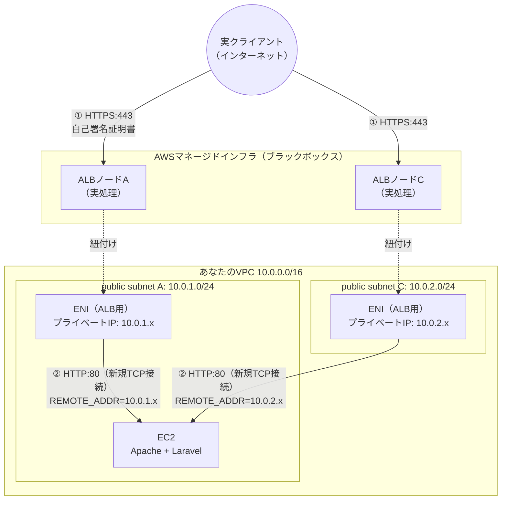
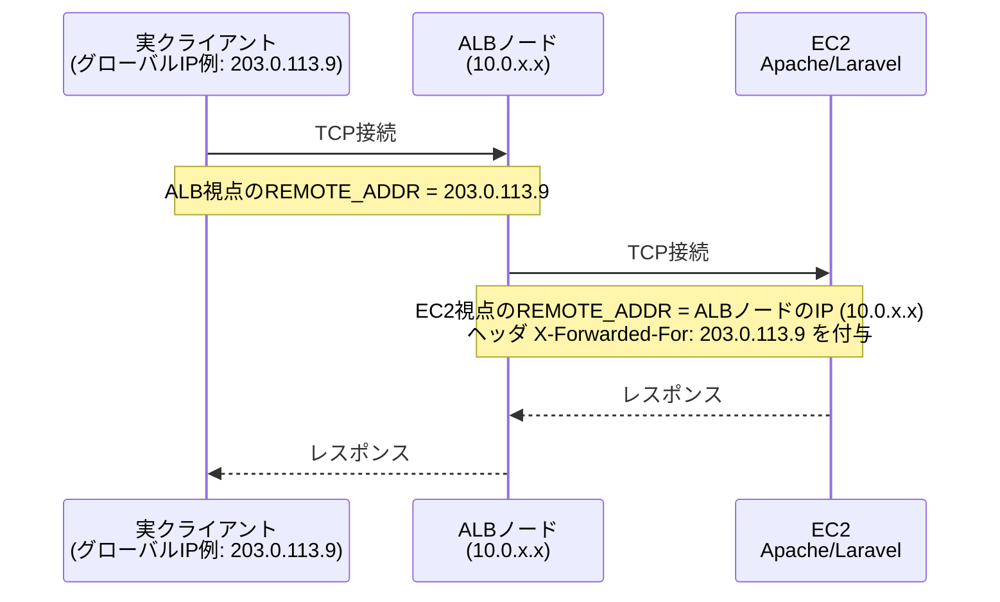

# TrustProxies / TrustHosts 解説

> このドキュメントはセキュリティの予備知識がなくても読めるように書いている。「HTTPヘッダは誰でも自由に書き換えられる」という前提さえ押さえれば、あとの話はすべてその応用。

## そもそも何が問題なのか（前提知識）

`X-Forwarded-For`・`X-Forwarded-Proto`・`Host` はどれも**ただのHTTPヘッダ**であり、リクエストを送る側（クライアント）が自由に書ける文字列にすぎない。

```bash
# 誰でもこう書ける。サーバー側で何も検証しなければ、これがそのまま信用されてしまう
curl http://example.com/ -H "X-Forwarded-For: 1.2.3.4"
```

ALBのような信頼できるロードバランサを経由したときだけ、こうしたヘッダを「本物」として扱いたい。しかしEC2（アプリサーバー）から見ると、ALB経由のリクエストも、悪意ある第三者が直接EC2を叩いて偽ヘッダを送ってきたリクエストも、**HTTPの見た目としては区別がつかない**。だからこそLaravelは既定で「直接つながってきた相手（＝ALBの内部IP）以外は何も信じない」という安全側に倒した挙動になっており、`trustProxies()`/`trustHosts()`で「どこまでなら信じてよいか」を明示的に指定する設計になっている。

この検証環境は、その「信じる／信じない」を切り替えたときに実際に何が起きるかを目で見て理解するためのものである。

## この構成の物理配置と、TrustProxiesが実際に見ているもの

### ALBは「マネージドなノード」＋「サブネット内の実ENI」のハイブリッド構成

正確には、ALBは「VPCの中に構築される」のでも「VPCの外にあってENI経由で話しかけてくるだけ」のでもなく、**両方の性質を併せ持つ**（[AWS公式ドキュメント](https://docs.aws.amazon.com/elasticloadbalancing/latest/application/application-load-balancers.html)で確認）。

- **ロードバランサーノード（実際の処理を行う実体）自体はAWSが完全管理するインフラ上で動作**しており、あなたのアカウント内にEC2のような「管理できるリソース」としては存在しない。
- しかし、有効化した各サブネット（このリポジトリでは2つのパブリックサブネット、AZごとに1つ）には、AWSが**実際にENIを作成して配置**する。このENIは：
  - そのサブネットのCIDRから**プライベートIPを1つ**受け取る（公式ドキュメント曰く "ENI reserved by ELB for subnet"。あなたのAWSアカウントのEC2コンソール→ネットワークインターフェースで実際に見える）
  - インターネット向けALBの場合は、AWSのパブリックIPv4プールから**パブリックElastic IPも1つ**アタッチされる（`service_managed=ALB`としてアカウントに見えるが変更・解放は不可）

つまり「ノードの計算処理」はAWS管理でブラックボックスだが、**そのノードがVPCと接続するための実体（ENI＋プライベートIP）は、文字通りあなたのサブネットの中に存在し、あなたのサブネットのIPアドレス空間を消費する**。だからこそEC2側で観測される`REMOTE_ADDR`は、必ずそのサブネットのCIDR内に収まる。



EC2のSG（`infra/security.tf`）は「ALBのSGからのport 80のみ」を許可しているため、これ以外の経路でEC2の80番に到達することはできない。

### ALBは client と EC2 の間で接続を「終端」する（L7プロキシ）

ここが理解の核心。ALBはL7（HTTP）ロードバランサなので、**クライアント⇔ALBの接続と、ALB⇔EC2の接続は別物のTCP接続**になる。ALBはクライアントとの接続をここで一旦終端し、EC2へは新しく接続を張り直す。



そのためEC2/Laravel側から見ると、`REMOTE_ADDR`（＝サーバーに直接TCP接続してきた相手のIP）は**常にALBノードのIP**であり、実クライアントのIPはどこにも直接は現れない。実クライアントのIPを知る唯一の手段が、ALBが付与する `X-Forwarded-For` ヘッダというわけである。

（実際の検証でも `REMOTE_ADDR: "10.0.2.73"` が観測された。これはまさに `10.0.2.0/24` サブネットに属するALBノードのIPである。）

### TrustProxiesが判定に使っているのは「接続元」であって「接続先」ではない

TrustProxiesの処理は次の2段階。**見ているのは常に「接続元」（＝今このリクエストを直接送ってきたのは誰か）であり、「接続先」（このEC2自身のIPやポート）は一切関係ない。**

1. 「今つながってきた `REMOTE_ADDR` は、`TRUST_PROXIES` に設定した信頼リストに含まれるか？」を判定する。リクエストの中身やヘッダの値はここでは見ない。純粋に「直接接続してきた相手のIP（＝接続元）」と設定値を突き合わせるだけ。
2. 1でYESだった場合に**限り**、そのリクエストに付いている `X-Forwarded-For` / `X-Forwarded-Proto` 等ヘッダの**値**を信用し、`ip()` / `isSecure()` / `getScheme()` の返り値をそちらに差し替える。NOなら、ヘッダは黙って無視され、`REMOTE_ADDR` と実際の接続プロトコル（EC2からは常にHTTP）がそのまま使われる。

## TrustProxies が変えるもの

Laravelはデフォルトでは直接接続してきたピア（このリポジトリでは常にALBの内部IP）だけを信頼する。ALBやCDNなどのリバースプロキシ経由でアクセスされる環境では、クライアントが送ってきた（あるいはプロキシが付与した）`X-Forwarded-For` / `X-Forwarded-Proto` / `X-Forwarded-Host` / `X-Forwarded-Port` ヘッダを信頼するかどうかを `bootstrap/app.php` の `trustProxies()` で明示的に設定する必要がある。

- 信頼しない（デフォルト）: `$request->ip()` はALBの内部IP、`isSecure()` は実際の接続プロトコル（EC2からはHTTPなので false）を返す。ALBが付けた `X-Forwarded-Proto: https` は**無視**される。
- 信頼する（`trustProxies(at: '*', ...)` など）: `X-Forwarded-For` の先頭（＝実クライアントIP）が `ip()` に、`X-Forwarded-Proto` が `isSecure()`/`getScheme()` に反映される。

このリポジトリでは `env('TRUST_PROXIES')` の値で切り替える（[bootstrap/app.php](../bootstrap/app.php)）:

| TRUST_PROXIES | 意味 |
|---|---|
| `none`（既定） | `trustProxies()` を呼ばない＝どのプロキシも信頼しない |
| `all` | `at: '*'` で全プロキシを信頼 |
| `10.0.0.0/16` のようなCIDR（カンマ区切り可） | 指定したCIDRのみ信頼 |

ヘッダの解釈には ALB 向けの `Request::HEADER_X_FORWARDED_AWS_ELB` ビットマスクを使用している。

### なぜ信頼先を絞る必要があるのか（具体例）

もしアプリがIPアドレスで管理画面へのアクセス制限（例:「社内IP `203.0.113.0/24` からのみ許可」）をしていたとする。`ip()` の値を信頼して判定している場合、`TRUST_PROXIES` が適切に絞られていないと、攻撃者は

```
X-Forwarded-For: 203.0.113.1
```

のようなヘッダを自分で付けて送るだけで、`ip()` の戻り値を偽装し、この制限を突破できてしまう。同様に、アクセスログやレート制限も `ip()` を元にしていることが多く、偽装できれば「誰の操作か分からなくする（ログ改ざん）」「1つのIPからの大量アクセスをまるで多数のユーザーからのアクセスに見せかけてレート制限を回避する」といった悪用が可能になる。

> **⚠️ この検証環境の `TRUST_PROXIES=all`（`at: '*'`）は、挙動を分かりやすく見せるためにあえて「全プロキシを信頼」する設定にしている。実際のプロダクション環境でこれをそのまま使ってはいけない。** `at: '*'` は「直接つながってきた相手（＝REMOTE_ADDR）を信頼する」という意味になるため、もしEC2に直接アクセスできる経路が万一開いてしまえば（SG設定ミス等）、そのままヘッダ偽装が成立してしまう。本番でどう設定すべきかは末尾の「[この構成における「あるべき」設定（べき論）](#この構成におけるあるべき設定べき論)」を参照。

## TrustHosts が変えるもの

`trustHosts()` を設定すると、リクエストの `Host` ヘッダが許可パターンにマッチしない場合、Laravelはリクエストを **400 Bad Request** で拒否する。ホストヘッダ偽装（後述）対策。

このリポジトリでは `env('TRUST_HOSTS')`（カンマ区切りの正規表現）で切り替える。空文字なら `trustHosts()` を呼ばず、全Hostを許可する。

> **補足（正確性のため）**: 一般にLaravelの `TrustHosts` は、`TrustProxies` 側で `X-Forwarded-Host` を信頼する設定（`HEADER_X_FORWARDED_HOST` ビット）になっていれば、そのヘッダも判定対象にする。しかし本リポジトリの `bootstrap/app.php` が使う `Request::HEADER_X_FORWARDED_AWS_ELB` はこのビットを**含んでいない**ため、`TrustHosts` は常に生の `Host` ヘッダだけを見る。
>
> **補足（ハマりどころ）**: `TrustHosts` は `APP_ENV=local` のときはLaravel側で自動的にスキップされる（`shouldSpecifyTrustedHosts()`）。ローカルで `TRUST_HOSTS` を試すときに「設定したのに400にならない」と思ったら、まず `.env` の `APP_ENV` を確認すること。本リポジトリの既定値は `APP_ENV=production` なので、ローカルでも通常は問題なく動く。
>
> **⚠️ 補足（実際に発生した事故①: ヘルスチェックが400で弾かれる）**: `TRUST_HOSTS` をALBのDNS名（`^.*\.elb\.amazonaws\.com$` 等）だけに絞ったまま放置すると、**ALB自身のヘルスチェックまで400で弾かれ、ターゲットグループがunhealthyになる**。実機で`public/`に一時的なデバッグ用PHPファイルを置いて`$_SERVER['HTTP_HOST']`を直接観測したところ、ALBのヘルスチェックリクエスト（`User-Agent: ELB-HealthChecker/2.0`）の`Host`ヘッダは**ターゲット（EC2）自身のプライベートIP**（例: `10.0.1.31`、ポート番号は付かない）であることを確認した。ALBのDNS名にしかマッチしないパターンではこれが弾かれてしまう。
>
> **⚠️ 補足（実際に発生した事故②: 正規表現の書き方でLaravelごと500クラッシュする）**: 上記対策として `TRUST_HOSTS=...,^10\.0\.[12]\.[0-9]{1,3}(:[0-9]+)?$` のように**量指定子 `{1,3}`（中括弧）を含むパターン**を設定したところ、400ではなく **500 Internal Server Error** になった。原因はSymfonyの `Request::setTrustedHosts()` が各パターンを内部で `{パターン}i` という**中括弧そのものをデリミタとして**囲む実装になっているため（`vendor/symfony/http-foundation/Request.php`）、パターン中の `{1,3}` がデリミタ用の中括弧と衝突し `preg_match(): No ending matching delimiter '}' found` で例外が発生していた。**`TRUST_HOSTS` の正規表現では `{n,m}` 形式の量指定子を避け、`[0-9]+` のように書くこと。**
>
> 対策まとめ:
> 1. `/up` のヘルスチェック確認が終わったら**必ず `TRUST_HOSTS` を検証前の値に戻す**。
> 2. 本番相当の値にする場合は、ALBのDNS名に加えて**ターゲットが属するサブネットのプライベートIP帯**にマッチするパターンも含める（例: `^10\.0\.[12]\.[0-9]+$`）。**中括弧`{}`を使う量指定子は避ける。**

### なぜHostヘッダの検証が必要なのか（具体例）

`Host` ヘッダもクライアントが自由に指定できる文字列である。Laravelの `url()` / `route()` 等のヘルパーは、絶対URLを組み立てる際にこの `Host`（正確には `getHost()`）を使う。もし検証していないと、たとえば「パスワードリセット用のリンクをメールで送る」機能で

```
リンク: https://<$request->getHost()>/reset-password?token=xxxxx
```

のようなURLを組み立てている場合、攻撃者が偽の `Host: attacker.example` ヘッダを付けてパスワードリセットをリクエストするだけで、正規ユーザー宛のメールに**攻撃者のドメインへのリンク**が埋め込まれてしまう（Host Header Injection）。ユーザーがそのリンクを踏むと、トークンが攻撃者のサーバーに送信され、アカウントを乗っ取られる。`TRUST_HOSTS` で許可するHostパターンを絞ることは、この手の攻撃を機械的にブロックする防御になる。

## 真理値表

| TRUST_PROXIES | ip() | is_secure | scheme |
|---|---|---|---|
| none | ALB内部IP | false | http |
| all / VPC CIDR | 実クライアントIP | true | https |

| TRUST_HOSTS | 正当Host（`*.elb.amazonaws.com`） | 不正Host（`evil.example`） |
|---|---|---|
| （空） | 200 | 200 |
| `^.*\.elb\.amazonaws\.com$` | 200 | 400 |

## 検証コマンドと期待出力

`ALB=$(terraform -chdir=infra output -raw alb_url)` として、すべて `curl -k`（自己署名のため）。EC2/ALBを構築する前にローカルで挙動だけ確認したい場合は、`php artisan whoami:check` / `php artisan env:set` を使うと `php artisan serve` やcurlを使わずに同じ確認ができる（README「artisanコマンドでの確認」参照）。

`.env` の書き換えはEC2側（SSMで入った先）、curlは手元のターミナルで実行する。手順の全体像・コピペ用コマンドはREADME「6. 検証の回し方」を参照。ここでは各状態での期待結果のみ示す。

### TrustProxies OFF（`.env`: `TRUST_PROXIES=none`、初期値）
```bash
curl -sk "$ALB/whoami" | jq
```
- `resolved.ip` = ALBの内部IP（`10.0.x.x`）
- `resolved.is_secure` = `false`、`resolved.scheme` = `http`、`resolved.full_url` は `http://` 始まり
- `raw.X-Forwarded-Proto` = `https`（ALBは付けているが信頼していないため解決値には反映されない）

### TrustProxies ON（`.env`: `TRUST_PROXIES=all`、reload後）

EC2側:
```bash
sudo sed -i 's/^TRUST_PROXIES=none/TRUST_PROXIES=all/' /var/www/app/.env
sudo systemctl reload apache2
```
手元:
```bash
curl -sk "$ALB/whoami" | jq
```
- `resolved.ip` = 実クライアントIP
- `resolved.is_secure` = `true`、`resolved.scheme` = `https`、`resolved.full_url` は `https://` 始まり

### POST
```bash
curl -sk -X POST "$ALB/whoami" | jq '.method'   # => "POST"（CSRFで419にならない）
```

### TrustHosts（`.env`: `TRUST_HOSTS=^.*\.elb\.amazonaws\.com$`、reload後）

EC2側:
```bash
sudo sed -i 's/^TRUST_HOSTS=.*/TRUST_HOSTS=^.*\\.elb\\.amazonaws\\.com$/' /var/www/app/.env
sudo systemctl reload apache2
```
手元:
```bash
curl -sk -o /dev/null -w "%{http_code}\n" "$ALB/whoami"                        # => 200
curl -sk -o /dev/null -w "%{http_code}\n" "$ALB/whoami" -H "Host: evil.example" # => 400
```
`TRUST_HOSTS=`（空、EC2側で `sudo sed -i 's/^TRUST_HOSTS=.*/TRUST_HOSTS=/' /var/www/app/.env` してreload）に戻すと両方 `200` になる。

## なぜ `config:cache` を使ってはいけないか

`php artisan config:cache` を実行すると、Laravelは以降 `.env` を読み込まずキャッシュされたconfig値だけを参照するようになる。`bootstrap/app.php` は `env('TRUST_PROXIES')` / `env('TRUST_HOSTS')` を**ミドルウェア登録時に直接**読んでいるため、config化されておらず、config:cacheしても更新はされない一方、`env()` 呼び出し自体はキャッシュ後 `null` を返すようになる（Laravelの既知の挙動）。結果として `.env` を書き換えても反映されなくなり、この検証環境の目的（envトグルだけで即座に挙動を切り替えて観測すること）が成立しなくなる。そのため本リポジトリでは **`config:cache` を一切使用しない**（`route:cache` / `view:cache` は影響を受けないため使用可）。

## `bootstrap/app.php` で `.env` を明示的に読み込んでいる理由

`withMiddleware()` に渡したコールバックは、HTTPカーネル（`HttpKernel::class`）がコンテナから解決されたタイミングで実行される。これは `LoadEnvironmentVariables` ブートストラッパー（`.env` を実際に読み込む処理）より**前**に発生するため、対策をしないとコールバック内の `env('TRUST_PROXIES')` / `env('TRUST_HOSTS')` は常に `.env` の内容を無視してデフォルト値（`none` / 空文字）を返してしまう（実機検証で確認済みの挙動）。これを避けるため `bootstrap/app.php` の冒頭で `Dotenv\Dotenv::createImmutable(...)->safeLoad()` を呼び、`.env` を先に読み込んでいる。後続の通常のブートストラップ処理（`LoadEnvironmentVariables`）は `createImmutable`（既存値を上書きしない）のため二重読み込みしても副作用はない。

## この構成における「あるべき」設定（べき論）

ここまでの `TRUST_PROXIES=none/all`、`TRUST_HOSTS=空/*.elb.amazonaws.com` という値は、**挙動の違いを分かりやすく見せるための教材用の値**であり、「これが推奨設定」という意味ではない。実際にこの構成（ALB 1台 + EC2 1台、独自ドメインなし）を運用するなら、以下が正しい設定になる。

| 項目 | 教材でのデモ値 | この構成での推奨値 |
|---|---|---|
| `TRUST_PROXIES` | `none` / `all` | `10.0.1.0/24,10.0.2.0/24`（ALBが乗っているパブリックサブネットのCIDR＝`var.public_subnet_cidrs`） |
| `TRUST_HOSTS` | 空 / `^.*\.elb\.amazonaws\.com$` | ①このALB自身のDNS名 **と** ②ターゲット自身のプライベートIP帯（ヘルスチェック用）の両方にマッチする正規表現 |

### TRUST_PROXIES: `none`でも`all`でもなく、ALBのサブネットCIDRに絞る

- **`none`は不可**: ALB経由であることをアプリが一切認識できず、`isSecure()`が常にfalseになる等、実用にならない。
- **`all`（`at:'*'`）は「今のSG設定に守られているから結果的に事故らないだけ」**: `infra/security.tf` のSGが「ALBのSGからのport 80のみ」を強制しているので、`all`でも今は実害が出ない。しかしこれは **ネットワーク層（SG）の防御に、アプリ層の設定がただ乗りしているだけ**の状態であり、アプリ層自体は何も守っていない。将来SGを緩めたり、EC2を別用途に転用したりした瞬間、ヘッダ偽装が即座に成立してしまう。ネットワーク層とアプリ層それぞれで独立に境界を表現しておく（多層防御）のが正しい設計。
- ALBの各ノードの個別IPはAWSのスケーリングに応じて変わりうるため現実的に運用できないが、**ALBが必ず存在するサブネットのCIDR**は変わらない。したがって `TRUST_PROXIES=10.0.1.0/24,10.0.2.0/24`（より簡便には `10.0.0.0/16` のVPC全体でも可）が、動的なALBに対する現実的かつ正確な絞り方になる。

### TRUST_HOSTS: `*.elb.amazonaws.com`ではなく、このALB固有のDNS名 **＋ ヘルスチェック用のパターン** に絞る

教材内で使っている `^.*\.elb\.amazonaws\.com$` は、**AWSの他のアカウント・他人のALBのDNS名も全部マッチしてしまう**ため緩すぎる。正しくは、実際にデプロイされたこのALB自身のDNS名（`terraform output -raw alb_dns_name`）だけにピンポイントで一致させたい。

ただし、**ALB自身のDNS名だけに絞ると、今度はALBのヘルスチェックが弾かれてターゲットグループがunhealthyになる**（前節の「実際に発生した事故①」を参照）。実機で観測したところ、ALBのヘルスチェックリクエストの`Host`ヘッダは、ALBのDNS名ではなく**ターゲット（EC2）自身のプライベートIP**（例: `10.0.1.31`、ポート番号なし）になる。したがって、実際に安全かつ壊れない設定にするには、**この2パターンをカンマ区切りで両方許可する**必要がある。

```
TRUST_HOSTS=^trust-verify-alb-1943783953\.ap-northeast-1\.elb\.amazonaws\.com$,^10\.0\.[12]\.[0-9]+$
```

- 1つ目: このALB自身のDNS名（実クライアントからの正規リクエスト用）
- 2つ目: `10.0.1.x` / `10.0.2.x`（＝EC2が起動しうるパブリックサブネットのCIDR、`var.public_subnet_cidrs`と対応）へのIP形式（ALBのヘルスチェック用。ターゲットが複数台・複数AZになる場合を見越してサブネット単位のCIDRで表現している）

**`[0-9]{1,3}` のように中括弧`{}`を使う量指定子は書かないこと**（前節の「実際に発生した事故②」参照。Symfonyがパターン全体を`{...}i`で囲むため、パターン内の中括弧と衝突してLaravelごと500エラーになる）。個別のALBノードIPやターゲットIPは動的に変わりうるため、`TRUST_PROXIES`のときと同様に「対象が必ず存在するサブネットのCIDRを表す正規表現」で表現するのが現実的かつ正確な絞り方になる。

理想は、1つ目のALB DNS名を手打ちせず **Terraformの `aws_lb.main.dns_name` から自動的に注入する**ことで、手打ちミスによる齟齬をなくすこと（例えば `infra/ec2.tf` の `templatefile()` に `alb_dns_name` も渡し、`user_data.sh.tpl` 側で `.env` に書き込む）。本リポジトリの既定構成にはまだ含めていない。
